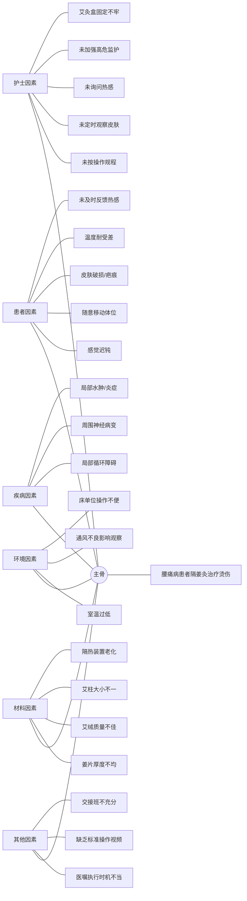

# 腰痛病患者隔姜灸治疗烫伤原因分析（鱼骨图）

```mermaid
graph LR
    %% 主骨与鱼头（右侧）
    N1[护士因素] --- Spine((主骨))
    N2[患者因素] --- Spine
    N3[疾病因素] --- Spine
    N4[环境因素] --- Spine
    N5[材料因素] --- Spine
    N6[其他因素] --- Spine
    Spine --- Head[腰痛病患者隔姜灸治疗烫伤]

    %% 护士因素（小刺）
    N1 --- N1a[未按操作规程]
    N1 --- N1b[未定时观察皮肤]
    N1 --- N1c[未询问热感]
    N1 --- N1d[未加强高危监护]
    N1 --- N1e[艾灸盒固定不牢]

    %% 患者因素（小刺）
    N2 --- N2a[感觉迟钝]
    N2 --- N2b[随意移动体位]
    N2 --- N2c[皮肤破损/疤痕]
    N2 --- N2d[温度耐受差]
    N2 --- N2e[未及时反馈热感]

    %% 疾病因素（小刺）
    N3 --- N3a[局部循环障碍]
    N3 --- N3b[周围神经病变]
    N3 --- N3c[局部水肿/炎症]

    %% 环境因素（小刺）
    N4 --- N4a[室温过低]
    N4 --- N4b[通风不良影响观察]
    N4 --- N4c[床单位操作不便]

    %% 材料因素（小刺）
    N5 --- N5a[姜片厚度不均]
    N5 --- N5b[艾绒质量不佳]
    N5 --- N5c[艾柱大小不一]
    N5 --- N5d[隔热装置老化]

    %% 其他因素（小刺）
    N6 --- N6a[医嘱执行时机不当]
    N6 --- N6b[缺乏标准操作视频]
    N6 --- N6c[交接班不充分]
```
